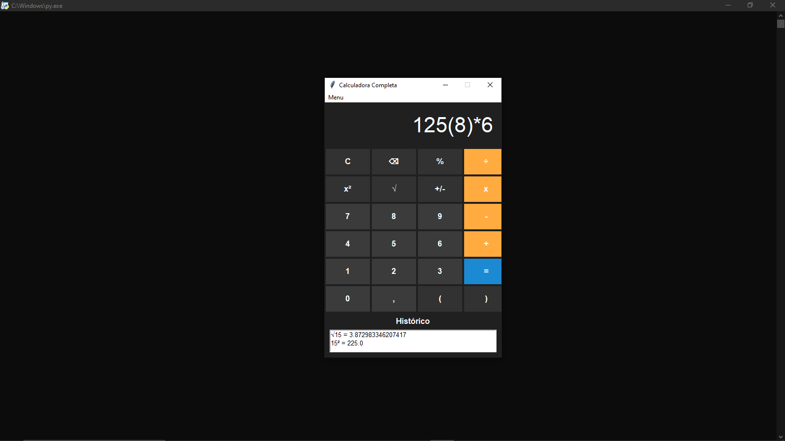

# 🧮 Python Calculator

My first desktop calculator developed with Python and Tkinter.

## Screenshot




## 🚀 Features

- Basic arithmetic operations
- Square root
- Square (x²)
- Percentage
- Positive / Negative
- Calculation history
- Light and Dark themes
- Keyboard shortcuts

## 🛠️ Technologies

- Python
- Tkinter
- Math
  
## ▶️ How to run

```bash
python main.py
```

## 👨‍💻 Author

**Breendom**

Software Engineering Student
